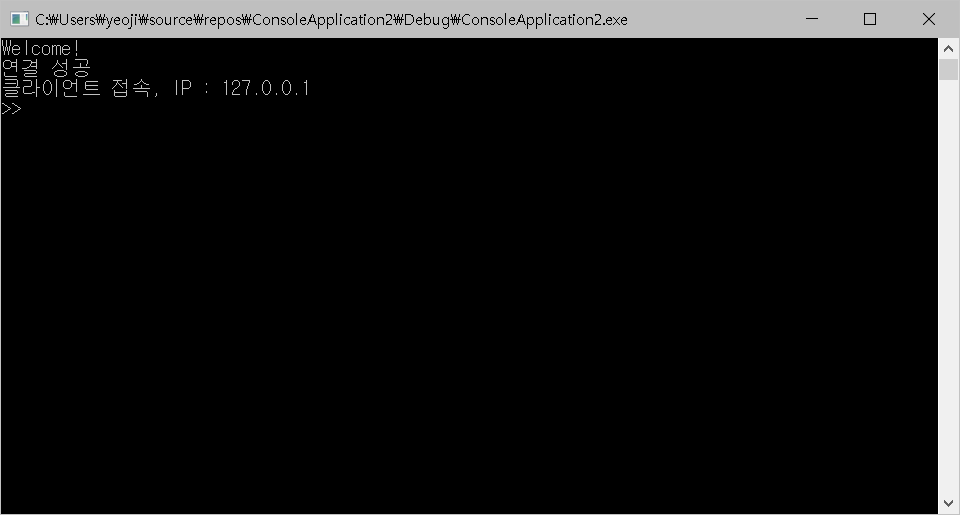
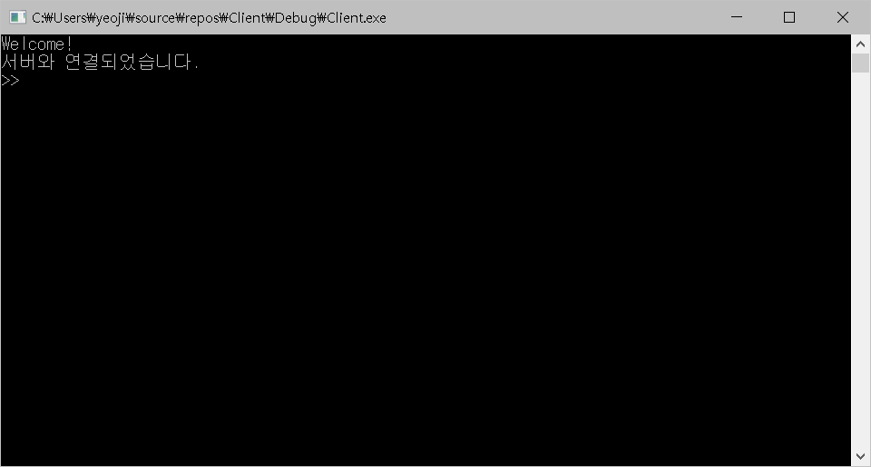
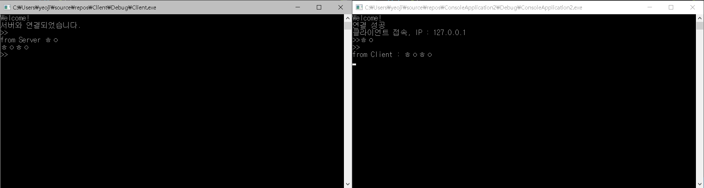

# C++ 기반의 TCP/IP 1:N 멀티 채팅 프로그램 개발

## 개발 환경
- IDE : Microsoft Visual Studio Community 2017 (C++98)

## Basic
- 서버 :  Socket 생성 → Socket Binding → 클라이언트 연결 대기(Listen) → 클라이언트(Accept) 받아들임 → 클라이언트의 명령 받아 서비스 수행
- 클라이언트 :  Socket 생성 → 서버에 연결시도 (connect) → 서버에 명령 전달

## Before Start
- 프로젝트 생성 시 Windows 콘솔 응용 프로그램을 생성해주세요
- 프로젝트 속성
    - C/C++ → 미리컴파일된 헤더 →  미리 컴파일된 헤더 사용 안함
    - C/C++ → 일반 → SDL 검사 → 아니요
    - 링커 → 입력 → 추가종속성 →ws2_32.lib 추가

## Header
- process.h
- WinSock2.h

## ScreenShot
- 서버측

- 클라이언트측

- 대화

